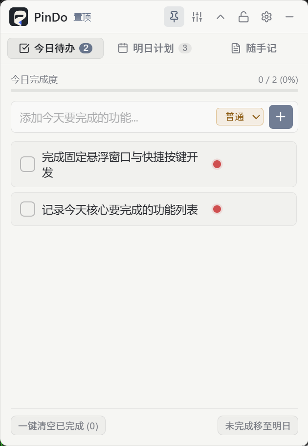

# PinDo 📌

> 极简、常驻置顶、不占任务栏空间的桌面悬浮待办便签工具。

<p align="center">
  
</p>

基于 **Tauri 2.0 + React 19 + SQLite** 开发，专为程序员、独立开发者与办公人群打造。随时随地记录今天任务、勾选进度、规划明日计划，不打扰主工作流。

---

## ✨ 核心特性

- 🚫 **无任务栏图标 (Skip Taskbar)**：窗口运行与最小化时，完全不在 Windows 系统任务栏及 `Alt + Tab` 列表中占用空间，保持系统桌面极简。
- 📌 **常驻置顶 (Always on Top)**：固定悬浮在所有应用（如 IDE、浏览器、文档）最上方，支持一键开关置顶。
- 🔒 **锁定保护模式 (Lock Mode)**：一键锁定，隐去控制按键与拖拽响应，防止工作或输入代码时误触、误拖动。
- ↕️ **一键折叠迷你胶囊 (Collapse Mode)**：双击标题栏或点击折叠按钮，窗口瞬间收起为 **42px 微型条**（并显示今日未完成数），再次双击即可展开。
- 🎚️ **透明度调节 (Opacity Control)**：支持 30% ~ 100% 磨砂玻璃不透明度自由滑动调节。
- 📝 **今日待办 (Today's Checklist)**：
  - 极简成就进度条（实时统计完成百分比与已完成数量）。
  - 支持紧急度标记（🔴紧急 / 🟡普通 / 🔵次要）。
  - 双击任务文本直接原地内联编辑。
  - 完成打勾中划线淡出动画，支持“一键清空已完成”与“未完成推迟至明日”。
- 🗓️ **明日计划 (Tomorrow's List)**：提前规划次日工作，支持晨间“一键导入至今日”。
- 💡 **随手记 (Quick Notes)**：临时粘贴代码片段、网址或灵感备忘，自带字数/行数统计与一键复制。
- 🔔 **系统托盘 (System Tray)**：驻留桌面右下角托盘，单击或右键快捷菜单可随时显示/隐藏窗口或退出。
- 💾 **SQLite 原生持久化 (`pindo.db`)**：所有任务、备忘与窗口偏好（折叠高度、置顶状态、透明度）自动写盘存储，重启零丢失。
- 🚀 **开机自启 (Autostart)**：内置开机自启开关，系统启动时自动后台驻留托盘。

---

## 🛠️ 技术选型

- **后端/桌面壳**：[Tauri 2.0](https://tauri.app/) (Rust)
  - 系统托盘组件 (`tauri::tray::TrayIconBuilder`)
  - 原生 SQLite 插件 (`@tauri-apps/plugin-sql`)
  - 开机自启插件 (`tauri-plugin-autostart`)
- **前端框架**：[React 19](https://react.dev/) + [Vite](https://vitejs.dev/)
- **图标库**：[Lucide React](https://lucide.dev/)
- **设计语言**：Modern Glassmorphism (亚克力磨砂玻璃视效)

---

## 🚀 快速开始

### 1. 环境准备
确保你的电脑已安装：
- [Node.js](https://nodejs.org/) (v18+)
- [Rust & Cargo](https://www.rust-lang.org/)
- Windows C++ Build Tools (VS C++ 生成工具)

### 2. 安装依赖
```bash
npm install
```

### 3. 开发模式运行
运行以下命令，会自动启动 Vite 前端服务并拉起 Tauri 桌面应用窗口：
```bash
npm run tauri dev
```

### 4. 构建打包发布
构建独立打包程序 (`.exe` 安装包/绿色版)：
```bash
npm run tauri build
```
打包文件将存放在 `src-tauri/target/release/bundle/` 目录中。

---

## 📁 项目结构

```text
fixNote/
├── docs/
│   └── preview.png          # README 预览效果图
├── src/
│   ├── assets/              # 静态资源
│   ├── data/
│   │   └── pindoDatabase.js # SQLite 数据库初始化与持久化逻辑
│   ├── App.jsx              # 核心业务界面与应用状态管理
│   ├── App.css              # Glassmorphic 样式与系统主题
│   └── main.jsx             # React 入口文件
├── src-tauri/
│   ├── capabilities/        # Tauri 权限配置文件
│   ├── src/
│   │   ├── lib.rs           # 系统托盘、菜单与 Rust 插件注册
│   │   └── main.rs          # Rust 程序入口
│   ├── Cargo.toml           # Rust 依赖配置
│   └── tauri.conf.json      # Tauri 窗口属性、skipTaskbar 与打包配置
├── package.json
└── README.md
```

---

## 📄 开源协议

[MIT License](LICENSE)
